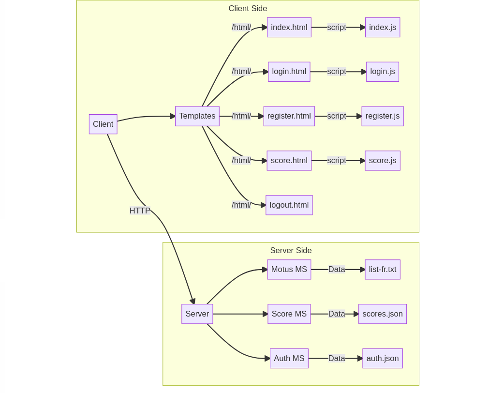

# Motus -- LE GUEN Yohann, BENLAIFAOUI Rayane - ING 3 IA 

# Table of Contents
1. [Structure du Projet](#StructureDuProjet)
2. [Lancement du projet](#Lancementduprojet)

   1.[Remarque](#Remarque)
3. [Connexion](#Connexion)
4. [Jeu et mise à jour du score :](#Jeuetmiseàjourduscore)
5. [Liste des API par micro service](#ListedesAPIparmicroservice)
6. [Ouverture](#Ouverture)

## Structure du Projet <a name ="StructureDuProjet"></a>





## Lancement du projet <a name ="Lancementduprojet"></a>
Après avoir récupérer le projet  ( https://github.com/YohannLG/MotusF.git ), et installer [Docker](https://docs.docker.com/get-docker/), nous pouvons à présent lancer le projet.
Dans notre projet nous avons 3 différents microservices. Par conséquent nous avons 3 ficher js. Afin d'éviter de les executer un par un dans 3 terminaux distincts, nous pouvons éxecuter et lancer le script de notre application via la commande 
```bash
docker-compose up -d
```
Une fois la commande éxécutée, rendez-vous sur la page d'accueil :  (http://localhost:3000/html/index.html)
### Remarque
Notre configuration docker nous permet de lancer le projet par la commande ci-dessus. Une image de l'application est donc créée dans un conteneur. Dans ce conteneur se trouve donc une totale copie de l'application, y compris les fichiers de données JSON. Il est donc nécessaire d'être prudent lorsqu'on utilise les commandes suivantes: 
```bash
docker-compose stop
ou
docker-compose down
```
En effet, la commande   ```docker-compose down``` supprime  les conteneurs, et lorsque vous utiliserez l'application, les fichiers json contenant les données seront modifiés dans ces conteneurs et non pas sur votre machine. Lancer cette derniere commande  fera donc disparaitre  les modifications apportées en cours de test.

## Connexion <a name ="Connexion"></a>

Avant toute chose, lorsque nous lançons notre appli nous allons être redirigé de force vers la page de connexion. En effet si le paramètre user est null alors on utilise la commande window.location = '/html/login.html' afin d'identifier l'utilisateur.
On a aussi la possibilité de créer un compte le cas échéant.

Afin de stocker notre liste d'utilisateur nous avons utilisé un fichier plat JSON. De même pour notre base de données qui gère le score et le met à jour.

Dans notre micro service authentification (auth_ms), on fait appel à l'API login.
Cette API permet de comparer le username ainsi que le password renseigné par l'utilisateur. Pour se faire nous allons donc comparer le login en input avec notre base de données. De même pour le mot de passe. Lorsque les deux conditions sont validées alors l'utilisateur est connecté et est dirigé vers la page index.html du jeu.

Les credentials de chaque utilisateur sont communiqués entre le script login.js ainsi que auth.js. Les deux se trouvant dans 2 micro services différents, nous avons utilisé la fonction fetch et passé en paramètre username et password. Afin de les recupérer nous avons plus qu'à faire :
req.query.username
req.query.password

Dans le cas où nous devons créer un compte, nous ferons appel à l'API register. POur cela on initialise une variable erreur init à 0 pour vérifier si le login renseigné est déjà utilisé, afin d'avoir des logins unique.
Les données sont communiquées une nouvelle fois entre le script register.js et auth.js grâce à fetch suivi de l'URL destination, avec les paramètres afin de pouvoir les récupérer.

Les données dans le cas de la création d'un compte sont directement envoyé vers l'api new_score dans le micro service score. Nous allons ajouté notre nouvel utilisateur et initialisé son score et son avg_try à 0.

## Jeu et mise à jour du score <a name ="Jeuetmiseàjourduscore"></a>

Tout d'abord pour jouer nous avons besoin d'un mot généré aléatoirement et qui sera identique pendant 24h. Nous avons aussi la possibilité de généré un nouveau mot aléatoire quand l'utilisateur souhaitera changer de mot.
POur cela nous avons conçu 2 API : word et new_word.
Ces 2 api fonctionnent de la même manière, on récupère la longueur du mot qui sera égale au nombre de case et grâce à notre fonction compareWords qui prend en paramètre le mot du jour ainsi que le mot entré par l'utilisateur et nous allons les comparer lettre par lettre. Nous avons trois cas de figure : 
- grid_ok 
- grid_misplaced
- grid_false

Si letter = grid_ok alors la case s'affiche en vert, si letter = grid_misplaced alors la case s'affiche en orange ce qui signifie qu'elle est présente dans le mot mais mal placé. Enfin si letter = grid_false alors la case est rouge car la lettre n'est pas dans le mot du jour.

Notre fonction compareWords renvoie un booleen. Initialiser à false et devient true quand toutes les lettres sont bonnes ce qui signifie que le mot est trouvé. A chaque appel de la fonction, on appel l'API score pour update le score et les essaies.

Nous allons donc ici envoyer les informations du services motus_ms à score_ms. Encore une fois nous allons donc utiliser fetch avec l'url destination c'est à dire le port 4000 qui gère le score. On envoie donc le user, le score et avg_tries.

Dans notre micro service score on retrouve plusieurs API comme get_score. Elle permet tout simplement d'aller lire dans notre json le score pour l'utilisateur connecté et lui afficher son score ainsi que la moyenne de ses tentatives. Le fichier score.html se trouvant dans le micro service motus, il faut donc utilisé fetch pour recupérer les données.

Pour mettre à jour le score on appel notre API update_score. Elle va parcourir la liste des utiliateurs jusqu'à récupérer les données de l'utilisateur connecté. Nous avons auparavant envoyer les données du micro service motus vers le micro service score grâce à cette ligne : 
```python 
fetch('http://localhost:4000/update_score?user='+user+'&score='+score+'&avg_tries='+avg_tries)
```

Une fois dans le micro service score on les récupère de cette manière :
```python
const user = req.query.user
const new_score = req.query.score
const new_avg = req.query.avg_tries
```
Il suffit donc alors de modifier les variables et d'écraser les données pour l'utilisateur en question dans notre fichier json.

 ## Liste des API par micro service <a name ="ListedesAPIparmicroservice"></a>
### Dans motus on retrouve :
- word permettant la génération d'un mot du jour aléatoire 
- new_word permettant la génération d'un nouveau mot à la demande du client

### Dans score on retrouve : 
- get_score permet de récupérer le score de l'user actif et d'afficher le score dans notre score.html
- update_score permet de mettre à jour le score de l'user (incrémenter score ou avg_tries)
- new_score initialise score et avg_tries à 0 pour chaque nouvel utilisateur créé

### Dans authentification on retrouve :
- login permet de se connecter si le login et le mdp match avec un object de notre database json
- register permet de créer un compte 


##Ouverture

Durant ce module nous avons pu apprendre et surtout comprendre quelle était la nécessité des micro services.
Par le biais d'une application, le jeu du motus, nous avons pu découper chaque grandes étapes que nous devions coder en parties indépendantes gérant ses propres responsabilitées.

Ce qui a été le plus dur pour nous est de comprendre comment était-il possible de créer une même application sur différent server. Tout d'abord on s'est demandé pourquoi faire cela. Dans notre manière habituelle de développer des appli on a tendance a tout mettre dans un seul fichier. Cependant si un bug survient, toute notre application serait down. Grâce aux microserivces, on peut éviter un tel prolème. En effet, dans le cas d'une appli developpé avec une architecture comprennant différents micro services seul le micro sevice ayant un bug sera non fonctionnel. De plus il sera plus facilement identifiable pour régler les 
